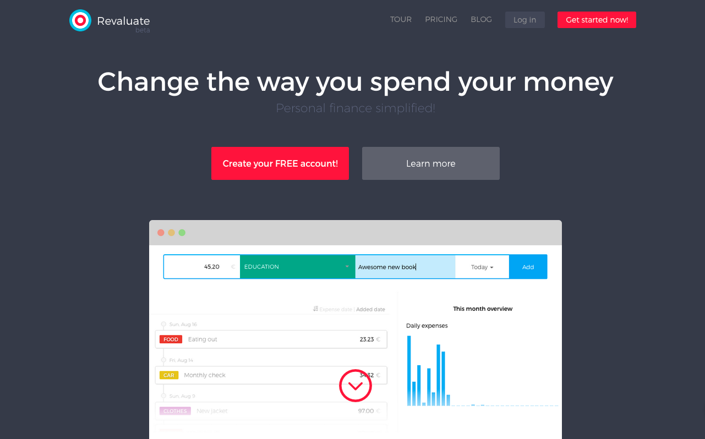
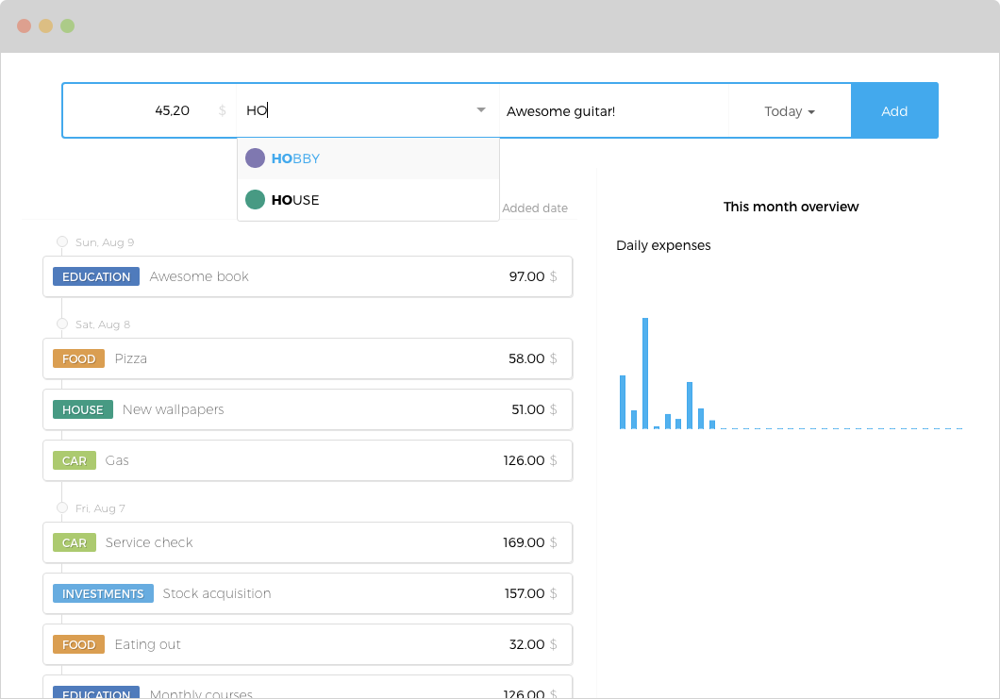
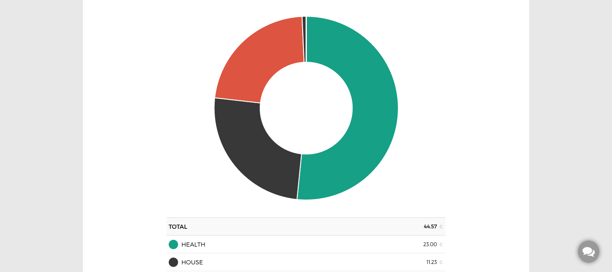
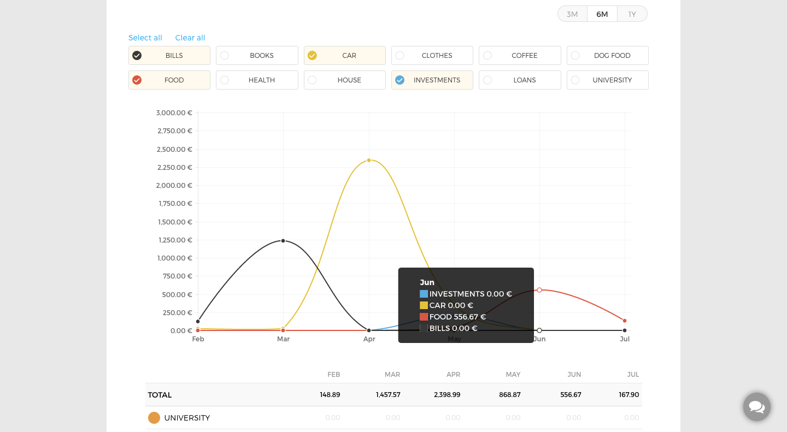
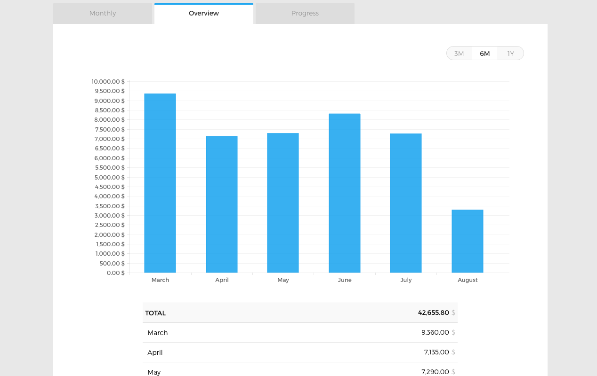
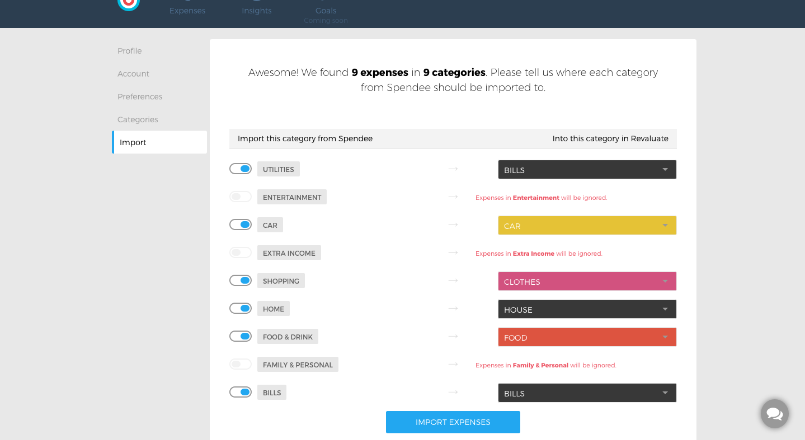
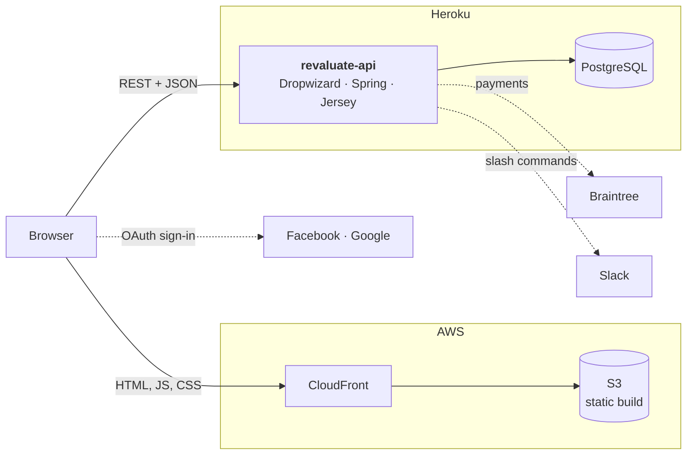

<div align="center">


# Revaluate

**Change the way you spend your money.**

A personal finance web app for logging expenses in seconds, understanding where the money goes, and setting monthly spending goals. Built and run in production from 2015 to 2017.


[](LICENSE)



[Product Hunt](https://www.producthunt.com/products/revaluate) · [Backend: `revaluate-api`](https://github.com/ioanlucut/revaluate-api) · [Screenshots](#a-tour-of-the-app)

</div>

## What Revaluate was

Revaluate was a personal finance manager for people who had given up on spreadsheets and bank apps. It launched as a public beta on 28 June 2015 at `revaluate.io`, shipped 15 releases by October 2015, and went on [Product Hunt](https://www.producthunt.com/products/revaluate) in September 2015.

Its pitch was simple: logging an expense should take as long as typing one line, and the app should turn those lines into insights you can act on.

- **Log an expense in one line.** Amount, category, description and date sit in a single keyboard-first row. The category field autocompletes as you type (`HO` → `HOBBY`, `HOUSE`), and Enter adds the expense.
- **Use your own categories.** Three or twenty, each with its own colour, which follows it through every chart.
- **See where the money goes.** Monthly breakdowns by category, 3-, 6- and 12-month overviews, and per-category trends over time.
- **Set goals that watch themselves.** _"Spend less than 500 € on food in September"_ becomes a progress bar that shows where you should be today.
- **Bring your history with you.** CSV import from Mint and Spendee, with a step that maps their categories onto yours.
- **Log from Slack.** An "Add to Slack" integration let teams record expenses with slash commands.

This repository is the web front end: a single-page app that talks to the Java [`revaluate-api`](https://github.com/ioanlucut/revaluate-api) over REST.

## A tour of the app

<table>
<tr>
<td width="50%"></td>
<td width="50%"></td>
</tr>
<tr>
<td><sub><b>Expenses.</b> One-line entry with category autocomplete, a day-by-day timeline and this month's daily spending.</sub></td>
<td><sub><b>Goals.</b> "Spend less or more than X on a category in a month", tracked against today.</sub></td>
</tr>
<tr>
<td></td>
<td></td>
</tr>
<tr>
<td><sub><b>Monthly insights.</b> Where the month's money went, as a pie or a bar chart.</sub></td>
<td><sub><b>Progress.</b> Compare any set of categories across 3, 6 or 12 months.</sub></td>
</tr>
<tr>
<td></td>
<td></td>
</tr>
<tr>
<td><sub><b>Overview.</b> Month-over-month totals.</sub></td>
<td><sub><b>Import.</b> Map another app's categories onto yours before importing.</sub></td>
</tr>
</table>

<sub>Screenshots are from the 2015 press kit. The 2016 redesign on <code>main</code> refreshes the layout and navigation.</sub>

## Timeline

| When                | Milestone                                                                                                                                                                 |
| ------------------- | ------------------------------------------------------------------------------------------------------------------------------------------------------------------------- |
| Feb 2015            | First commit. The API was started two weeks earlier.                                                                                                                      |
| May 2015            | Payments (Braintree) and CSV import.                                                                                                                                      |
| **28 Jun 2015**     | **Public beta, version `1.0.0`.**                                                                                                                                         |
| Jun – Oct 2015      | Fourteen more releases, `1.0.1` to `1.0.9`. From `1.0.5` on, each was codenamed after a TV character: Jon Snow, Phil Dunphy, Chandler Bing, Oliver Queen, Joey Tribbiani. |
| Aug – Sep 2015      | Goals, then the Slack integration.                                                                                                                                        |
| **Sep 2015**        | **Launched on Product Hunt** with version `1.0.8`.                                                                                                                        |
| Oct 2015            | Redesigned landing page and app header.                                                                                                                                   |
| Dec 2015 – Apr 2016 | Moved the code base to ES2015 modules, Babel and webpack, then AngularJS 1.5 components.                                                                                  |
| Sep – Oct 2016      | Visual makeover of the app and the home page.                                                                                                                             |
| Nov 2016            | Last production deploy.                                                                                                                                                   |
| Mar 2017            | Last commit: the redesign merged into `develop`.                                                                                                                          |
| 2026                | Repository cleaned up and published as a portfolio piece.                                                                                                                 |

In numbers: about **1,800 commits** in two years, **15 releases**, **13 feature modules**, and about **12k lines of JavaScript**, **3k lines of templates** and **9k lines of Sass**.

## Architecture



- **The front end** is an AngularJS single-page app with HTML5 routing (`ui-router`). The build is static, served from S3 behind CloudFront, so the only moving part is the API.
- **The back end**, [`revaluate-api`](https://github.com/ioanlucut/revaluate-api), is a Java service (Dropwizard, Spring, Jersey, JPA with Hibernate, Flyway migrations) on Heroku with PostgreSQL. It handles accounts, expenses, insights, goals, CSV parsing, Braintree subscriptions, emails and the Slack commands.
- **Configuration per environment** (`local`, `local-dev`, `development`, `production`) lives in [`gulp/app.config.*.json`](gulp) and is compiled into an Angular constant (`ENV`) at build time.

### Feature modules

Every feature is a self-contained module under [`src/app/components`](src/app/components) that owns its routes, components, services, templates and styles.

| Module                                                                                                                                                                       | What it does                                                                                                                     |
| ---------------------------------------------------------------------------------------------------------------------------------------------------------------------------- | -------------------------------------------------------------------------------------------------------------------------------- |
| [`expenses`](src/app/components/expenses)                                                                                                                                    | One-line entry, day-grouped timeline with infinite scroll, per-category drill-down, the monthly goals and daily insight widgets. |
| [`categories`](src/app/components/categories)                                                                                                                                | Custom categories with a colour picker, and safe deletion.                                                                       |
| [`insights`](src/app/components/insights)                                                                                                                                    | Daily, monthly, overview and progress charts (Chart.js).                                                                         |
| [`goals`](src/app/components/goals)                                                                                                                                          | Monthly spending goals with progress against today.                                                                              |
| [`import`](src/app/components/import)                                                                                                                                        | CSV upload, parsing and category matching for Mint and Spendee exports.                                                          |
| [`integrations`](src/app/components/integrations)                                                                                                                            | "Add to Slack" OAuth and the list of connected teams.                                                                            |
| [`account`](src/app/components/account)                                                                                                                                      | Sign-up, email confirmation, password reset, Facebook and Google sign-in.                                                        |
| [`settings`](src/app/components/settings)                                                                                                                                    | Profile, preferences (currency), subscription and payment, account deletion.                                                     |
| [`site`](src/app/components/site)                                                                                                                                            | Home page, pricing, terms, privacy and the error pages.                                                                          |
| [`feedback`](src/app/components/feedback), [`contact`](src/app/components/contact), [`intercom`](src/app/components/intercom), [`statistics`](src/app/components/statistics) | In-app feedback, contact form, support chat and product analytics.                                                               |

Shared UI (header, sidebar, monthly date picker, flash messages, spinner) lives in [`src/app/common`](src/app/common).

## Engineering highlights

- **An ES5 → ES2015 migration done with codemods, not by hand.** In early 2016 the code base moved from IIFE-wrapped `angular.module` files to ES2015 modules with Babel and webpack. The rewrite was scripted with [Lebab and Recast transforms](utils) that turned module declarations into `import`/`export` graphs. After that the app moved to AngularJS 1.5 `.component()`s.
- **A complete build and deploy pipeline.** Gulp drives webpack (Babel, `ng-annotate`, ESLint), Sass with Autoprefixer, template caching, image optimisation, asset revisioning and gzip. [`gulp/deploy.js`](gulp/deploy.js) publishes to S3 and invalidates CloudFront.
- **Deploys driven by branches.** On CircleCI, `develop` and `master` shipped to `dev.revaluate.io` and `production` shipped to `www.revaluate.io`, each built with its own environment config.
- **Tests at two levels.** Karma and Jasmine unit specs sit next to the code (`*_test.js`). End-to-end Protractor suites with page objects live in [`e2e`](e2e).
- **Steady releases.** Semantic versions with codenames, and Angular-style commit messages such as `feat(goals): …`.

## Project layout

```
src/
├── index.html                  app shell, meta tags, analytics snippets
├── app/
│   ├── index.module.js         webpack entry
│   ├── indexApp.js             root module: dependencies, routing, charts, i18n
│   ├── indexBootstrapper.js    deferred bootstrap: fetches app config before Angular starts
│   ├── config/                 generated ENV constant
│   ├── common/                 shared layout and UI components
│   └── components/             13 feature modules (see above)
├── sass/                       design system: Bourbon, Neat, Bitters, fonts, icons
└── assets/                     images, fonts, favicons
gulp/                           build, serve, test, config and deploy tasks
e2e/                            Protractor end-to-end suites
utils/                          ES5 → ES2015 codemods
```

## Running it today

Revaluate is **archived**. The code is here to be read, not deployed:

- **The toolchain is from 2015–16.** It needs Node 5, Gulp 3, Bower, Ruby Sass and PhantomJS, and one Bower dependency points to a fork that no longer exists. A modern Node won't install it as is.
- **The back end is offline.** The Heroku apps and `revaluate.io` were shut down, so everything past the landing page needs a local [`revaluate-api`](https://github.com/ioanlucut/revaluate-api).

With a period-correct environment, this is how it ran:

```bash
npm install                     # also runs bower install
gulp serve --env=local          # dev server on :3000, API on localhost:8080
gulp build:prod                 # static build in dist/
npm test                        # Karma unit tests
```

Deploying needs `gulp/app.config.<env>.private.json` with S3 and CloudFront settings; see the [example](gulp/app.config.production.private.example.json).

## About this repository

- **One branch.** `main` holds the full history: the 2015 releases, then the 2016 redesign and the ES2015 refactor on top.
- **History.** It was rewritten in 2026 before publishing. Deploy credentials, personal data (email addresses, photos of people, testimonial names), generated configs, committed build output and the press-kit archive were purged. Commit dates and authors were preserved, and author emails now point to GitHub `noreply` addresses. The OAuth client IDs and analytics keys left in `gulp/app.config.*.json` are public, browser-side identifiers for apps that no longer exist.

## Team

- **[Ioan Lucuț](https://github.com/ioanlucut)**: engineering. Front-end architecture and most of the application code, the build and deploy pipeline, and the whole [`revaluate-api`](https://github.com/ioanlucut/revaluate-api) back end.
- **[Sorin Pantis](https://github.com/sorinpantis)**: product and design. Visual design, the landing page and much of the styling; about 40% of this repository's commits.
- **Felix** wrote the first Protractor end-to-end tests.

## License

[MIT](LICENSE) © 2015–2026 Ioan Lucuț
