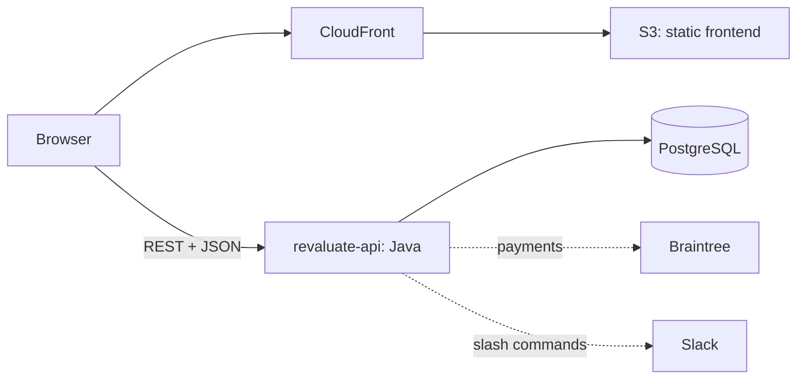

# Technical notes

[Back to the project story](../README.md)

Revaluate was developed in 2015–2017. These notes describe the implementation preserved in this repository, not a recommended stack for a new application.

## How it fit together

The frontend was an AngularJS single-page app with `ui-router`, built into static assets and served from S3 behind CloudFront. It called the Java [`revaluate-api`](https://github.com/ioanlucut/revaluate-api) over REST. The API ran on Heroku with PostgreSQL, using Dropwizard, Spring, Jersey, Hibernate, and Flyway.

The API handled accounts, expenses, insights, goals, CSV parsing, Braintree subscriptions, emails, and Slack commands. Facebook and Google provided social sign-in.



Environment configuration lived in [`gulp/app.config.*.json`](../gulp) and was compiled into the Angular constant `ENV` at build time.

## Finding your way around

- [`src/app/components`](../src/app/components) contains the feature modules: expenses, categories, insights, goals, imports, integrations, accounts, settings, the public site, feedback, contact, support chat, and analytics.

- [`src/app/common`](../src/app/common) holds shared UI and services, including navigation, date pickers, notifications, and session handling.

- [`src/sass`](../src/sass) contains the shared styles, built with Sass, Bourbon, Neat, and Bitters.

- [`gulp`](../gulp) contains build, development-server, test, configuration, and deployment tasks.

- [`e2e`](../e2e) contains the historical Protractor suites and page objects.

- [`utils`](../utils) preserves one-off migration scripts.

## Changes along the way

### Moving from ES5 to ES2015

In early 2016, the application moved from IIFE-wrapped `angular.module` files to ES2015 modules with Babel and webpack, then to AngularJS components. The framework stayed in place rather than being replaced in a rewrite.

The [migration scripts](../utils) used Lebab for syntax conversion, regex-based structural rewrites, and Recast for printing. They were tailored to particular source shapes and directories and are kept as historical artifacts, not reusable codemods. AST-based transformations with before/after fixtures and syntax checks would be a safer approach for a similar migration today.

### Bringing in existing expenses

The [import controller](../src/app/components/import/expenses-import/ImportExpensesController.js) coordinates a staged flow: upload a Mint or Spendee CSV for server-side analysis, let the user map or skip source categories, and submit the selected mappings. Parsing stays in the API; the browser handles review and distinguishes upload failures from import failures.

That review step gives users control over how their old categories fit their new ones. The code also preserves a legacy API compromise: skipped entries still need a valid category in the payload. An explicit representation of skipped entries would make that contract clearer.

### Building and shipping

Gulp drove webpack, Babel, `ng-annotate`, ESLint, Sass, Autoprefixer, template caching, image optimisation, asset revisioning, and gzip. The [deployment task](../gulp/deploy.js) published to S3 and invalidated CloudFront.

Historically, CircleCI built different environment configurations by branch: `develop` and `master` shipped to `dev.revaluate.io`, while `production` shipped to `www.revaluate.io`. Those deployments and the old CI setup are no longer active.

## Historical tooling

The frontend depended on Node.js `5`, Gulp `3`, Bower, Ruby Sass, and PhantomJS. One Bower dependency points to a fork that no longer exists. These commands document how development worked; they are **not a working quick start for a modern machine**:

```bash
npm install                     # also ran bower install
gulp serve --env=local          # frontend on :3000, API on localhost:8080
gulp build:prod                 # static build in dist/
npm test                        # Karma unit tests
```

Deployment also required a private environment configuration; only an [example](../gulp/app.config.production.private.example.json) is included.

The backend has a separate [restoration and quick start](https://github.com/ioanlucut/revaluate-api#quick-start). That does not restore frontend compatibility by itself.

## What is checked today

There are twelve historical Karma/Jasmine unit-spec files alongside the source and two Protractor E2E spec files. These suites have not been revalidated with the retired toolchain.

A small, dependency-free syntax check can run from the repository root with Node.js `24` or newer and Bash:

```bash
bash scripts/check-syntax.sh
```

[Archive checks](../.github/workflows/archive-checks.yml) runs the same command on pushes and pull requests using Node.js `24`. It parses every JavaScript file under `src/app`, including the historical unit specs, without executing them. It does not resolve imports, build the application, run those tests, or verify browser/API compatibility.

## Archive history

The `main` branch preserves the development history, including the 2015 releases, the ES2015 refactor, and the later redesign.

History was rewritten in 2026 before publication to remove deployment credentials, personal data, generated configurations, committed build output, and the press-kit archive. Commit dates and authors were preserved; author emails use GitHub `noreply` addresses. Remaining OAuth client IDs and analytics keys are public browser-side identifiers for retired integrations.
